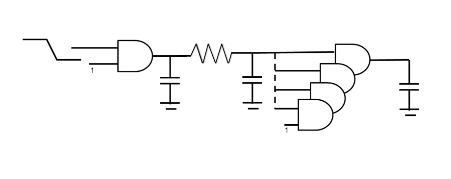
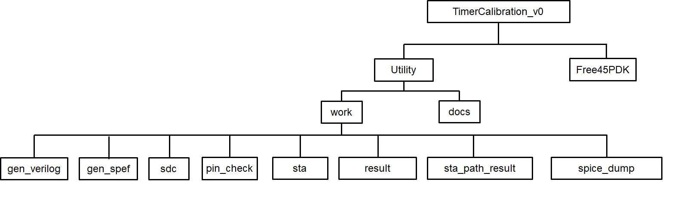
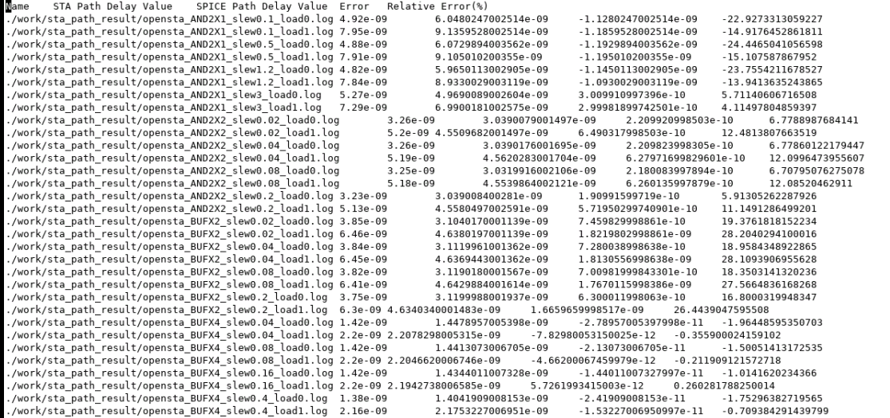
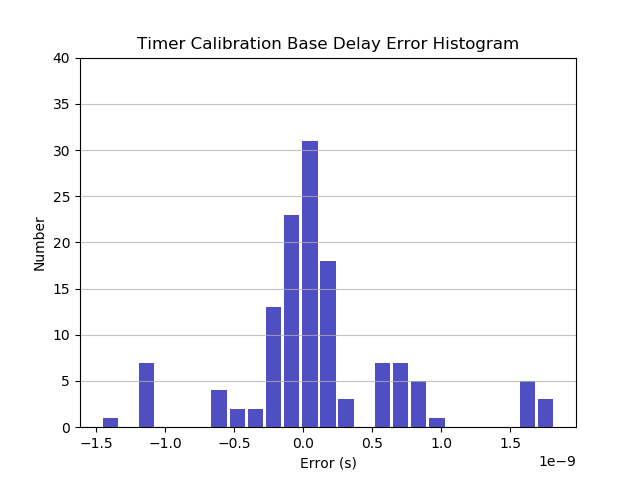

# Timer Calibration Utility
User can use the script for generating 2-stage structure with parasitic resistance 
and capacitance to calibrate timing between OpenSTA and HSPICE as shown in the figure 
below. The purpose is to validate the timing correctness between liberaries and SPICE 
circuit netlist. We validate the following items.

|  |
|:--:|
| *An example of 2-stage structure with parasitic resistance.* |

#### Base delay:
User can calibrate basic path/cell delay between libraries and HSPICE results.

##### Signal integrity (SI) features:
User can calibrate timing between libraries and HSPICE results with crosstalk
 
#### Statistical on-chip variation:
User can calibrate timing between libraries and HSPICE results considering the
statistical distribution of delay of each cells. 

#### Glitch noise propagation:
User can calibrate timing between libraries and HSPICE results when the glitch
noise is propagated. Currently, OpenSTA does not support CCS noise format library.

### Pre-requisite
* OpenSTA binary: https://github.com/abk-openroad/OpenSTA
* HSPICE: L-2016.06-SP2

### Directory Structure

|  |
|:--:|
| *Directory Structure Figure* |

| Directory |  Description  |
| --------- |  -----------  |
|  docs | 		Readme.md and introduction of configuration file.|
|  Free45PDK |	Free45PDK library, model cards, and cell spice netlists. |
|  sdc |	Design constraint file for OpenSTA. |
| spice_dump |	Dumped SPICE netlist from OpenSTA. |
| sta |	Generated OpenSTA tcl script for generating the timing report and SPICE netlist. |
| sta_path_result | 	Dumped OpenSTA path delay timing report. |
| result |	HSPICE measurement(.mt0) file after HSPICE simulation. |
| gen_spef |  Generated .spef file for OpenSTA. |
| gen_verilog |  Generated verilog file for OpenSTA. |
| pin_check | Logs of reading liberaries parser. |

### Input and Output Files

| Input Files |  Description  |
| --------- |  -----------  |
|  SPICE model card | SPICE model card, such as gpdk45nm.m. |
|  Library |	Library, such as gpdk45nm.lib. |
|  Cell SPICE netlist |	Cell SPICE netlist, such as cells.sp. |
|  Configuration file |	Configuration file to run timer calibration. Please see config_introduction.md. |
|  Cell input pin assignment file | Cell input pin assignment for verilog generation, such as ./TimerCalibration/utility/INPUT_ASSIGNMENT |

| Output Files | Description |
| --------- |  -----------  |
| SPICE measurement results | HSPICE measurement (.mt0) in result directory. |
| Dumped SPICE netlists | HSPICE netlist dumped by OpenSTA in spice_dump directory. |
| OpenSTA timing report | Dumped OpenSTA path timing report in sta_path_result directory. |
| OpenSTA summary report |  Summary report in OpenSTA_Summary_Report.txt. |

User can examine the OpenSTA path delays, SPICE path delay, error and relative error in OpenSTA 
summary report. 

### Quick Start
#### Required files
* Configuration files
* Cell SPICE netlist
* Cell input pin assignment file (Ex: INPUT_ASSIGNMENT)
* Model card
* Library file (Ex: gscl45nm.lib)

      $ git clone --recursive https://github.com/abk-openroad/OpenROAD-Utilities.git
      $ cd TimerCalibration/utility
      $ ln -s <OpenSTA binary> ./sta
      $ ./run.pl -cfg <configuration file> // (Ex: ./run.pl -cfg ./Free45PDK_cfg/AND2X1.cfg )  

### Batch Run Example

    $ git clone --recursive https://github.com/abk-openroad/OpenROAD-Utilities.git
    $ cd TimerCalibration/utility
    $ ln -s <OpenSTA binary> ./sta
    $ ./run_all.sh

### Verified/Supported Technology
* Free45PDK
* ASAP7: http://asap.asu.edu/asap/download/pdk-license/

### Eample Technology
* Free45PDK
The summary report and histogram of path delay error between OpenSTA and HSPICE result 
are in the below.

|  |
|:--:|
| *Summary Report* |

|  |
|:--:|
| *Free45PDK Error Histogram* |

### Authors
* Chia-Tung Ho (c2ho@eng.ucsd.edu)
* Andrew B. Kahng (abk@eng.ucsd.edu)
* Kambiz Samadi (ksamadi@qti.qualcomm.com)
* Sorin Dobre (sdobre@qti.qualcomm.com)
